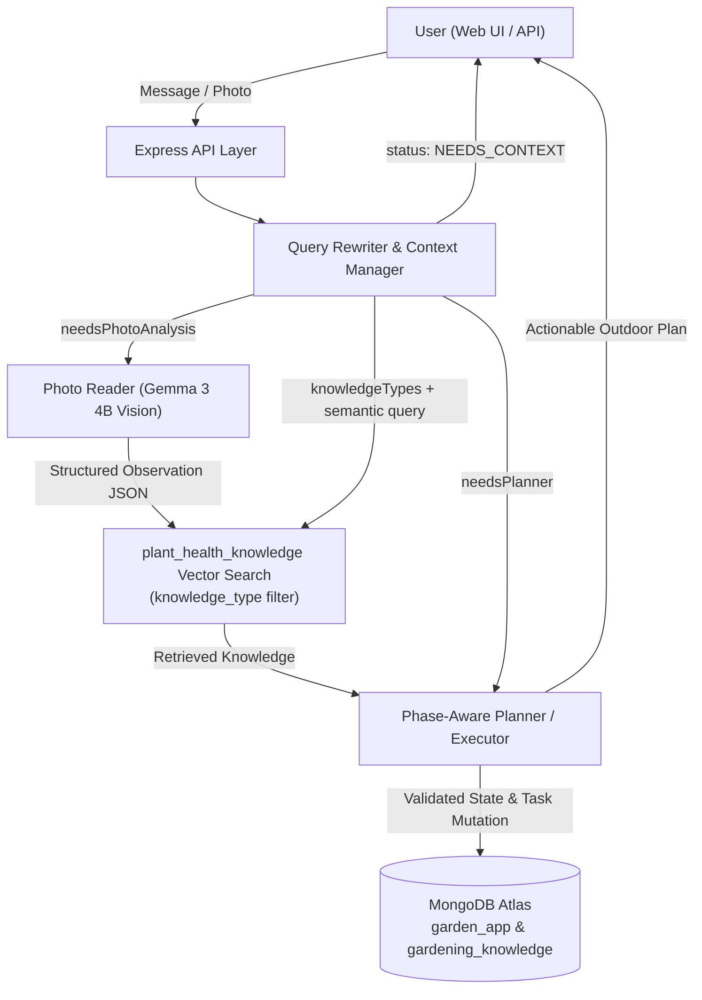

# AI Gardener ("Touch Grass") — Implementation Plan

An open-source, outdoor-first AI gardening assistant built for **Hacktoberfest 2026 Week 1 ("Touch Grass")**, architected with **Node.js**, **Express**, **MongoDB Atlas (Persistence + Vector Search)**, and **Gemma 3 (4B) via Ollama**.

---

## 1. Repository Inspection & Workspace Setup

- **Current Workspace State**: You do not currently have an active workspace open.
- **Target Project Directory**: We will create a new project folder at:
  `C:\Users\hp\Desktop\ai-gardener`
- **No Conflicts**: Because this is a clean greenfield directory, no existing files will be overwritten.

> [!TIP]
> Once we begin implementation, you can open `C:\Users\hp\Desktop\ai-gardener` as your active workspace in Antigravity IDE.

---

## 2. Core System Architecture

The application is a modular **monolithic Node.js + Express backend** paired with a lightweight, distraction-free Vanilla JS web frontend. All logical components live in clean internal service layers rather than separate microservices.



### Key Architectural Guarantees
1. **Clarification Loop & Minimum Sufficient Context**: The Query Rewriter merges newly extracted entities (`location`, `land`, `preferredPlants`, `sunlightHours`, `soilType`, `waterAvailability`) into `session.gardenState.context` before evaluating completeness. It only asks for missing *required* fields and never re-asks what is already known.
2. **Strict Separation of Conversation vs. Persistent Garden State**: `garden_sessions` stores `gardenState` (context, current phase, day, growing plants, observations, tasks, current X-day plan) separately from `conversationHistory`.
3. **Vision is Observational Only**: `PHOTO → GEMMA 3 → STRUCTURED OBSERVATION → plant_health_knowledge VECTOR SEARCH → PLANNER → DECISION → DB UPDATE`. The Photo Reader never mutates the database or transitions gardening phases directly, and explicitly tracks `confidence` and `uncertainties`.
4. **Single Phase-Aware Planner**: One Planner service operates using phase-specific instruction sets (`PLANTING`, `GROWING`, `MAINTENANCE`) and manages task lifecycles (`PENDING`, `IN_PROGRESS`, `COMPLETED`, `RESCHEDULED`, `FAILED`) plus phase transitions.
5. **Modular AI & Embedding Providers**:
   - `AIProvider` interface (`generateText`, `analyzeImage`, `generateStructuredOutput`) implemented by `OllamaProvider` (`gemma3:4b`).
   - `EmbeddingProvider` interface (`embedText`, `embedBatch`) implemented by `OllamaEmbeddingProvider` (e.g., `nomic-embed-text` or configurable via `.env`).
   - Runtime schema validation (via `zod`) ensures raw LLM outputs are validated before any state update.


---

## 3. Proposed Project Structure

All files will be created inside `C:\Users\hp\.gemini\antigravity\scratch\ai-gardener`:

```text
ai-gardener/
├── .env.example
├── .gitignore
├── package.json
├── render.yaml
├── README.md
├── data/
│   └── seed_knowledge.json          # Unified plant health knowledge (all knowledge_type values)
├── scripts/
│   ├── seed.js                      # Seeds MongoDB Atlas + generates embeddings via Ollama
│   ├── demo-path-1.js               # End-to-end CLI demo: Clarification loop -> Vector Search -> Plan
│   └── demo-path-2.js               # End-to-end CLI demo: Photo -> Gemma Vision -> Knowledge Search -> Replan
├── public/
│   ├── index.html                   # Minimal "Touch Grass" UI (Action Card, Chat/Photo, Pipeline Inspector)
│   ├── styles.css
│   └── app.js
└── src/
    ├── config/
    │   ├── env.js                   # Centralized environment config with defaults & validation
    │   └── db.js                    # MongoDB Atlas connection manager (garden_app & gardening_knowledge)
    ├── models/
    │   └── schemas.js               # Zod schemas for Context, RouterDecision, PhotoObservation, PlannerOutput, Tasks
    ├── prompts/
    │   ├── queryRewriter.prompt.js
    │   ├── photoReader.prompt.js
    │   ├── planner.prompt.js
    │   └── directAnswer.prompt.js
    ├── repositories/
    │   ├── userRepository.js
    │   ├── sessionRepository.js
    │   └── plantHealthKnowledgeRepository.js  # Unified repo for plant_health_knowledge
    ├── services/
    │   ├── ai/
    │   │   ├── AIProvider.js
    │   │   ├── OllamaProvider.js
    │   │   └── index.js
    │   ├── embeddings/
    │   │   ├── EmbeddingProvider.js
    │   │   ├── OllamaEmbeddingProvider.js
    │   │   └── index.js
    │   ├── vectorSearch/
    │   │   └── knowledgeVectorSearch.js       # Single $vectorSearch with knowledge_type filter
    │   ├── context/
    │   │   └── queryRewriter.js
    │   ├── photo/
    │   │   └── photoReader.js
    │   ├── planner/
    │   │   └── plannerService.js
    │   └── orchestrator/
    │       └── gardenOrchestrator.js          # Coordinates the KNOW -> PLAN -> ACT -> OBSERVE -> UPDATE loop
    ├── controllers/
    │   ├── sessionController.js
    │   └── taskController.js
    ├── routes/
    │   └── api.js
    ├── utils/
    │   ├── jsonParser.js            # Safe LLM JSON extraction + Zod validation wrapper
    │   └── logger.js
    ├── app.js
    └── server.js
```


---

## 4. Database & Vector Search Design (MongoDB Atlas)

### Databases & Collections
1. **Database: `garden_app`** (configurable via `MONGODB_APP_DB`)
   - `users`: `{ _id, name, createdAt }`
   - `garden_sessions`:
     ```json
     {
       "_id": "session_uuid",
       "userId": "user_uuid",
       "gardenState": {
         "context": {
           "location": { "city": "Gorakhpur", "country": "India" },
           "land": { "area": 100, "unit": "sq_ft" },
           "preferredPlants": ["tomato", "chilli"],
           "sunlightHours": 6,
           "soilType": null,
           "waterAvailability": null
         },
         "currentPhase": "PLANTING",
         "currentDay": 1,
         "plantsGrowing": [
           { "plant": "tomato", "growthStage": "seedling", "healthStatus": "healthy" }
         ],
         "currentPlan": {
           "durationDays": 7,
           "summary": "...",
           "dailySchedule": []
         },
         "observations": [],
         "photoObservations": []
       },
       "tasks": [
         {
           "taskId": "task_1",
           "title": "Prepare top 8 inches of soil",
           "description": "...",
           "phase": "PLANTING",
           "status": "PENDING",
           "scheduledFor": "Day 1",
           "completedAt": null
         }
       ],
       "conversationHistory": [],
       "updatedAt": "2026-10-06T..."
     }
     ```
2. **Database: `gardening_knowledge`** (configurable via `MONGODB_KNOWLEDGE_DB`)
   - **Single collection: `plant_health_knowledge`**
   - Each document carries a `knowledge_type` field for filtering. Supported values:
     ```
     PLANT_BASIC · PLANTING · SOIL · WATER · SUNLIGHT · CLIMATE
     GROWTH_STAGE · NUTRITION · NUTRIENT_DEFICIENCY · HEALTHY_BASELINE
     DISEASE · PEST · ENVIRONMENTAL_STRESS · PHYSIOLOGICAL_DISORDER
     PREVENTION · MAINTENANCE · HARVESTING
     ```
   - Document shape:
     ```json
     {
       "plant": "tomato",
       "knowledge_type": "DISEASE",
       "title": "Early Blight",
       "aliases": ["Alternaria blight"],
       "tags": ["fungal", "leaf-spots", "lower-leaves"],
       "knowledgeText": "Early blight is caused by Alternaria solani...",
       "structuredData": {
         "symptoms": ["brown circular spots", "yellowing lower leaves"],
         "causes": "Alternaria solani fungus, high humidity",
         "treatment": "Apply copper-based fungicide...",
         "prevention": "Crop rotation, remove infected leaves",
         "severity": "moderate",
         "warningSigns": ["lesions with concentric rings"]
       },
       "embedding": [...]
     }
     ```
   - The `structuredData` sub-object is flexible per `knowledge_type` (disease symptoms, soil pH ranges, growth stage timelines, etc.) while keeping `plant`, `knowledge_type`, `tags`, `knowledgeText`, and `embedding` consistent across all records.

### Query Rewriter → Knowledge Routing

The Query Rewriter constructs a `knowledgeQuery` object instead of toggling two separate search paths:

```json
{
  "semanticQuery": "yellowing lower leaves brown circular spots tomato",
  "knowledgeTypes": ["DISEASE", "PEST", "NUTRIENT_DEFICIENCY", "HEALTHY_BASELINE"],
  "plantFilter": "tomato"
}
```

Examples:

| User Input | `knowledgeTypes` |
|---|---|
| "How should I grow tomatoes?" | `PLANT_BASIC, PLANTING, SOIL, WATER, SUNLIGHT, CLIMATE` |
| "My tomato leaves have yellow spots" + photo | `DISEASE, PEST, NUTRIENT_DEFICIENCY, ENVIRONMENTAL_STRESS, HEALTHY_BASELINE` |
| "Does my plant look healthy?" | `HEALTHY_BASELINE, GROWTH_STAGE` |
| "What should I do today?" | `MAINTENANCE, GROWTH_STAGE, PREVENTION` |

### Single Vector Search Index

- **`plant_health_knowledge_vector_index`** on `gardening_knowledge.plant_health_knowledge`
- Fields: `embedding` (vector, cosine, 768 dims) + `plant` (filter) + `knowledge_type` (filter) + `tags` (filter)
- The `knowledgeVectorSearch` service passes `knowledge_type: { $in: [...] }` as a pre-filter to scope results without running separate queries.
- *Resilience*: Includes automatic in-memory cosine fallback while Atlas index is building.


---

## 5. Incremental Implementation Phases

We will build and verify the project in the exact 9-phase sequence requested:

- **Phase 1**: Node.js + Express setup, `.env.example`, MongoDB Atlas connection, `users` & `garden_sessions` repositories, and basic session/chat API routes.
- **Phase 2**: Query Rewriter / Context Manager (`src/services/context/queryRewriter.js`), incremental context extraction & merging, missing-context detection, and clarification loop.
- **Phase 3**: `EmbeddingProvider` (`OllamaEmbeddingProvider`), `plant_health_knowledge` seed data (`data/seed_knowledge.json`) & ingestion script (`scripts/seed.js`), and `knowledgeVectorSearch.js` with `knowledge_type` pre-filtering.
- **Phase 4**: Phase-aware `Planner` (`PLANTING`, `GROWING`, `MAINTENANCE`), task lifecycle management (`PENDING`, `IN_PROGRESS`, `COMPLETED`, `RESCHEDULED`, `FAILED`), and X-day plan generation.
- **Phase 5**: `AIProvider` (`OllamaProvider` for `gemma3:4b`) with structured JSON enforcement and Zod runtime validation.
- **Phase 6**: `POST /api/sessions/:sessionId/photo` with `multer`, `PhotoReader` service using Gemma 3 4B multimodal vision, and structured observation extraction with confidence/uncertainty tracking.
- **Phase 7**: Expand `data/seed_knowledge.json` with `DISEASE`, `PEST`, `NUTRIENT_DEFICIENCY`, `ENVIRONMENTAL_STRESS`, and `HEALTHY_BASELINE` records. Verify symptom-to-knowledge semantic retrieval via `knowledgeVectorSearch` with appropriate `knowledgeTypes` filter.
- **Phase 8**: Full orchestration loop (`gardenOrchestrator.js`): `Photo / Message → Observation / Context → knowledgeVectorSearch (typed) → Planner → Validated DB Update`.
- **Phase 9**: Simple "Touch Grass" Web Frontend (`public/`), `render.yaml` deployment blueprint, comprehensive `README.md` (setup, Ollama, MongoDB Atlas, Vector Search JSON definitions, API examples), and verification of the two end-to-end demo paths.


---

## 6. Verification Plan

1. **Automated Schema & Flow Verification**:
   - Run `scripts/seed.js` to verify knowledge ingestion and embedding generation.
   - Run `scripts/demo-path-1.js` to test the incomplete request → clarification loop → context completion → plant vector search → planner output.
   - Run `scripts/demo-path-2.js` to test photo upload → Gemma 3 vision observation → disease vector search → planner recommendation & state update.
2. **API & Frontend Verification**:
   - Start `npm start` and test all 6 REST endpoints (`POST /api/sessions`, `GET /api/sessions/:sessionId`, `POST /api/sessions/:sessionId/message`, `POST /api/sessions/:sessionId/photo`, `GET /api/sessions/:sessionId/tasks`, `POST /api/tasks/:taskId/complete`).

---

## Open Questions / Review

1. **Project Directory Name**: I plan to create the project at `C:\Users\hp\.gemini\antigravity\scratch\ai-gardener`. Does that folder name work for you?
2. **Default Embedding Model in Ollama**: I plan to default `EMBEDDING_MODEL` in `.env.example` to `nomic-embed-text` (768 dimensions, lightweight and standard on Ollama), while keeping it configurable via `.env`. Would you prefer `nomic-embed-text` or another Ollama embedding model such as `all-minilm` or `mxbai-embed-large`?
